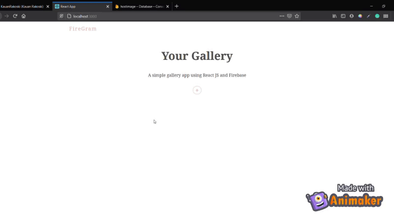

# FireGram

This project was bootstrapped with [Create React App](https://github.com/facebook/create-react-app).

### About

A react gallery that integrates with Firebase to upload files and show them to the user. Below is a quick demo, notice that file dialog does not show up.

### features
- Upload image (with error treatment)
- Expand box on click
- Sweet animations using framer-motion